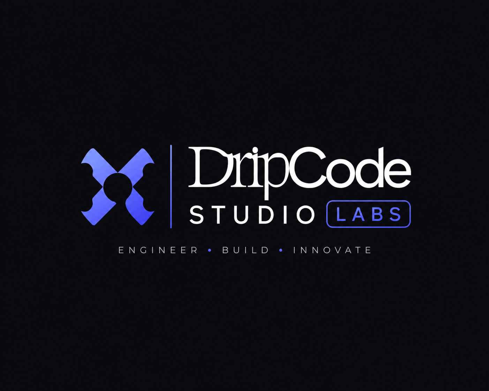

# DripCode Studio Labs



The engineering arm of [DripCode Studio](https://www.dripcodestudio.com) — a digital agency where design meets code.

## What this is

A curated output platform showcasing:

- **Labs** — internal tools, experiments, and side projects
- **Client Work** — production builds, SaaS platforms, dashboards, and landing pages

## Tech stack

- Next.js 16 (App Router)
- React 19
- TypeScript
- TailwindCSS v4
- Framer Motion
- Lucide React

## Getting started

```bash
npm install
npm run dev
```

Open [http://localhost:3000](http://localhost:3000).

## Project structure

```
src/
  app/          # Pages (/, /labs, /work, /work/[slug], /about, /contact)
  components/   # Reusable UI components
  data/         # Static data (labs, work projects)
  lib/          # Utilities
public/         # Static assets
```

## Adding content

- **Labs**: edit `src/data/labs.ts`
- **Client work**: edit `src/data/work.ts` (each entry generates a case study at `/work/[slug]`)

## Deploy

```bash
npm run build
```

Deploy to Vercel with zero config.
